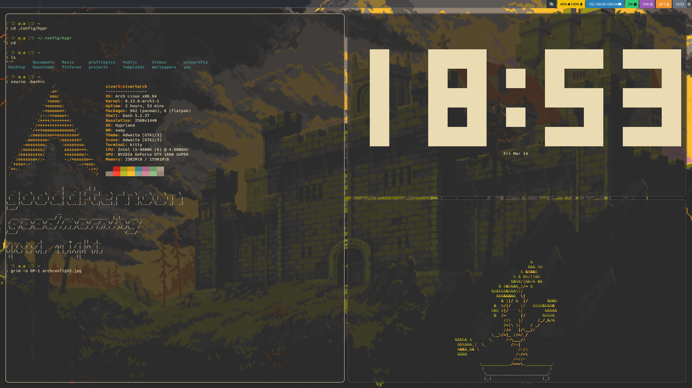

# sivertdotfiles
Her finner du alle mine config-filer til diverse program, "rice-en" min.

There are some fonts and such i have installed, for example:

sudo pacman -S noto-fonts noto-fonts-cjk noto-fonts-emoji

There is the Hack Nerd Font for starship and other icons, and noto for missing symbols, for example in a kaomoji.
